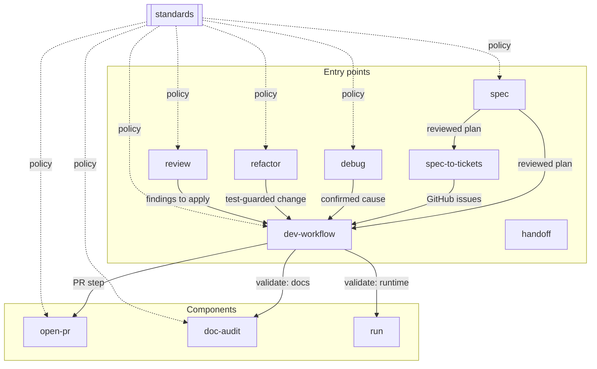

# Engineering skill composition

How the engineering skills fit together: which are entry points a request lands on, which are components another skill invokes, and who hands off to whom.
An autonomous runner reads this to route a request to the right entry point without reverse-engineering each skill.

## The graph

Solid arrows are runtime hand-offs (one skill invokes or feeds the next).
Dotted arrows are policy references — `standards` is read for its rules, never invoked as a step.

## Roles

| Skill | Role | Lands on it when | Hands off to |
| --- | --- | --- | --- |
| `spec` | Entry — planning | A request needs scoping into a reviewed plan before building | `spec-to-tickets` (to file issues) or `dev-workflow` (to execute) |
| `spec-to-tickets` | Entry — ticketing | A reviewed spec should become GitHub Issues | `dev-workflow` (executes each issue) |
| `debug` | Entry — diagnosis | Something is broken and the cause is unknown | `dev-workflow` (lands the fix as a regression-tested change) |
| `refactor` | Entry — restructuring | Working code needs its structure improved without behavior change | `dev-workflow` (lands the test-guarded change) |
| `dev-workflow` | Entry + spine | Any request to write and land code in a GitHub repo | invokes `doc-audit`, `run`, `open-pr` |
| `review` | Entry — gate | Changes need checking before they land | reports only; findings go to `dev-workflow` to apply |
| `handoff` | Entry — utility | A conversation needs compacting for another agent to continue | none (produces a document) |
| `open-pr` | Component | `dev-workflow` reaches its PR step, or a PR is opened standalone | none |
| `doc-audit` | Component | `dev-workflow` validates, or docs/comments are written standalone | none |
| `run` | Component | `dev-workflow` validates a change with a runtime surface | none |
| `standards` | Reference | Any skill applies a house rule | none — read, not invoked |

## Composition rules

- **`dev-workflow` is the spine.** Every skill that produces a code change hands the landing of it to `dev-workflow` rather than opening worktrees or PRs itself.
- **Entry points don't invoke each other's mechanics.** `debug` proves a cause but doesn't commit; `review` reports but doesn't apply; `spec` plans but doesn't build. Each stays in its lane and hands off.
- **Components are leaves.** `open-pr`, `doc-audit`, and `run` are invoked by an entry point and don't hand off further.
- **`standards` is policy, not a phase.** It is referenced for its rules — never inserted as a numbered step.
