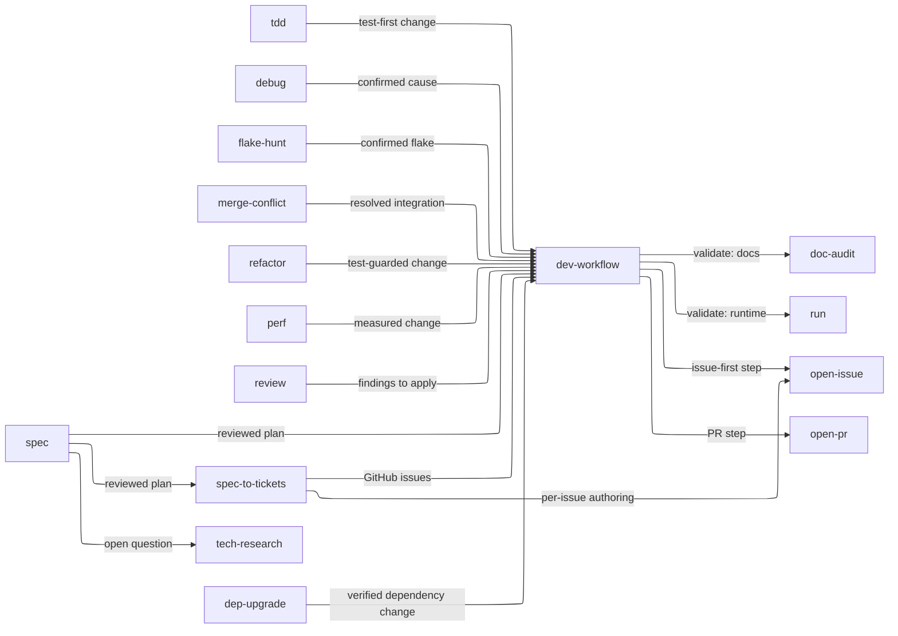

# Engineering skill composition

How the engineering skills fit together: which are entry points a request lands on, which are components another skill invokes, and who hands off to whom.
An autonomous runner reads this to route a request to the right entry point without reverse-engineering each skill.

## The graph

```mermaid
%%{init: {'flowchart': {'defaultRenderer': 'elk'}}}%%
flowchart LR
    spec[spec]
    tdd[tdd]
    debug[debug]
    flakehunt[flake-hunt]
    mergeconflict[merge-conflict]
    refactor[refactor]
    perf[perf]
    review[review]
    s2t[spec-to-tickets]
    techresearch[tech-research]
    depupgrade[dep-upgrade]
    devworkflow[dev-workflow]
    docaudit[doc-audit]
    run[run]
    openissue[open-issue]
    openpr[open-pr]

    spec -->|reviewed plan| s2t
    spec -->|reviewed plan| devworkflow
    spec -->|open question| techresearch
    s2t -->|GitHub issues| devworkflow
    s2t -->|per-issue authoring| openissue
    tdd -->|test-first change| devworkflow
    debug -->|confirmed cause| devworkflow
    flakehunt -->|confirmed flake| devworkflow
    mergeconflict -->|resolved integration| devworkflow
    refactor -->|test-guarded change| devworkflow
    perf -->|measured change| devworkflow
    depupgrade -->|verified dependency change| devworkflow
    review -->|findings to apply| devworkflow

    devworkflow -->|issue-first step| openissue
    devworkflow -->|validate: docs| docaudit
    devworkflow -->|validate: runtime| run
    devworkflow -->|PR step| openpr
```

Arrows are runtime hand-offs (one skill invokes or feeds the next).
`standards` and `design` are missing on purpose: both are policy references, never invoked as a step, so an edge from each node would repeat the same fact rather than add one. `standards` is read by nearly every skill above; `design` by `spec`, `refactor`, `review`, and `tdd`. `perf` doesn't join that list - its guard is a benchmark, not a structural judgment call.
`mermaid` is missing too, for a related reason: it's invoked rather than merely read, but by nearly every skill that writes a diagram, so drawing it in would clutter the graph the same way.
`tdd` doubles as a component: it's drawn above as an entry point handing a change to `dev-workflow`, and `dev-workflow` names it in turn as the option for building test-first. The back edge is omitted to keep the graph acyclic.
`tech-research` has the same shape in miniature: drawn as an entry point `spec` reaches at an open question, but its findings file exists so `spec` can cite it back instead of re-deriving the answer, which would be a `spec`-to-`tech-research`-to-`spec` loop. The back edge is omitted for the same reason as `tdd`'s.
See the role table for who reads or invokes what.
`handoff` is missing for the opposite reason: it hands off to nothing and nothing hands off to it, so it has no edge to draw.

## Roles

| Skill | Role | Lands on it when | Hands off to |
| --- | --- | --- | --- |
| `spec` | Entry — planning | A request needs scoping into a reviewed plan before building | `spec-to-tickets` (to file issues) or `dev-workflow` (to execute) |
| `spec-to-tickets` | Entry — ticketing | A reviewed spec should become GitHub Issues | `open-issue` (writes and files each one), then `dev-workflow` (executes each issue) |
| `tech-research` | Entry — research | A technical question needs a sourced, version-pinned answer about third-party or external behavior | none (produces a findings file); `spec` cites it instead of re-deriving |
| `dep-upgrade` | Entry - dependency maintenance | A uv-managed Python project needs a dependency, lockfile, or git-sourced internal tag upgraded | `dev-workflow` (lands the verified dependency change) |
| `tdd` | Entry — test-first loop | A request is explicitly test-first ("TDD this", "write the test first", "red, green, refactor") | `dev-workflow` (lands the test-driven change) |
| `debug` | Entry — diagnosis | Something is broken and the cause is unknown | `dev-workflow` (lands the fix as a regression-tested change) |
| `flake-hunt` | Entry - flake diagnosis | A test failure may be intermittent, order-dependent, seed-dependent, or limited to CI | `dev-workflow` (lands the fix or bounded quarantine) |
| `merge-conflict` | Entry - integration recovery | A Git merge or rebase has conflicts that require semantic resolution | `dev-workflow` (resumes validation and the remaining integration workflow) |
| `refactor` | Entry — restructuring | Working code needs its structure improved without behavior change | `dev-workflow` (lands the test-guarded change) |
| `perf` | Entry — optimization | A change needs to get faster, cheaper, or higher-throughput, and the improvement must be proven with a before/after measurement | `dev-workflow` (lands the measured change) |
| `dev-workflow` | Entry + spine | Any request to write and land code in a GitHub repo | invokes `open-issue`, `doc-audit`, `run`, `open-pr`, and `tdd` for an explicitly test-first request |
| `review` | Entry — gate | Changes need checking before they land | reports only; findings go to `dev-workflow` to apply |
| `handoff` | Entry — utility | A conversation needs compacting for another agent to continue | none (produces a document) |
| `open-issue` | Component | `dev-workflow` reaches its issue-first step, `spec-to-tickets` files a work item, or an issue is opened standalone | none |
| `open-pr` | Component | `dev-workflow` reaches its PR step, or a PR is opened standalone | none |
| `doc-audit` | Component | `dev-workflow` validates, or docs/comments are written standalone | none |
| `run` | Component — harness-provided, not a skill in this repo | `dev-workflow` validates a change with a runtime surface | none |
| `mermaid` | Component | Any skill drafts, renders, or refines a diagram in a doc, spec, PR, or ADR | none |
| `standards` | Reference | Any skill applies a house rule | none — read, not invoked |
| `design` | Reference | Any skill judges or explains a structural decision | none — read, not invoked |

## Composition rules

- **`dev-workflow` is the spine.** Every skill that produces a code change hands the landing of it to `dev-workflow` rather than opening worktrees or PRs itself.
- **Entry points don't invoke each other's mechanics.** `tdd` drives the red-green-refactor loop but doesn't touch worktree/PR mechanics; `debug` proves a cause but doesn't commit; `refactor` and `perf` each prove their own guarantee (an unchanged test suite, a before/after measurement) but don't commit either; `dep-upgrade` proves a lockfile and downstream-suite result but doesn't commit; `review` reports but doesn't apply; `tech-research` answers a question but doesn't build; `spec` plans but doesn't build. Each stays in its lane and hands off.
- **Components are leaves, except `tdd`.** `open-issue`, `open-pr`, `doc-audit`, `run`, and `mermaid` are invoked by another skill and don't hand off further. `tdd` is invoked by `dev-workflow`'s own step the same way, but as an entry point in its own right it hands back to `dev-workflow` rather than terminating there; see the dual-role note under "The graph".
- **Delegation isn't hand-off.** `doc-audit` (its language check) and `mermaid` (its render loop) hand work to a subagent rather than to another skill; both stay leaves.
- **`standards` and `design` are policy, not phases.** Each is referenced for its own kind of rule — compliance for `standards`, structural vocabulary for `design` — never inserted as a numbered step.
- **`merge-conflict` completes the active merge or rebase.** It returns to `dev-workflow` for any remaining validation, publication, or PR lifecycle work.
