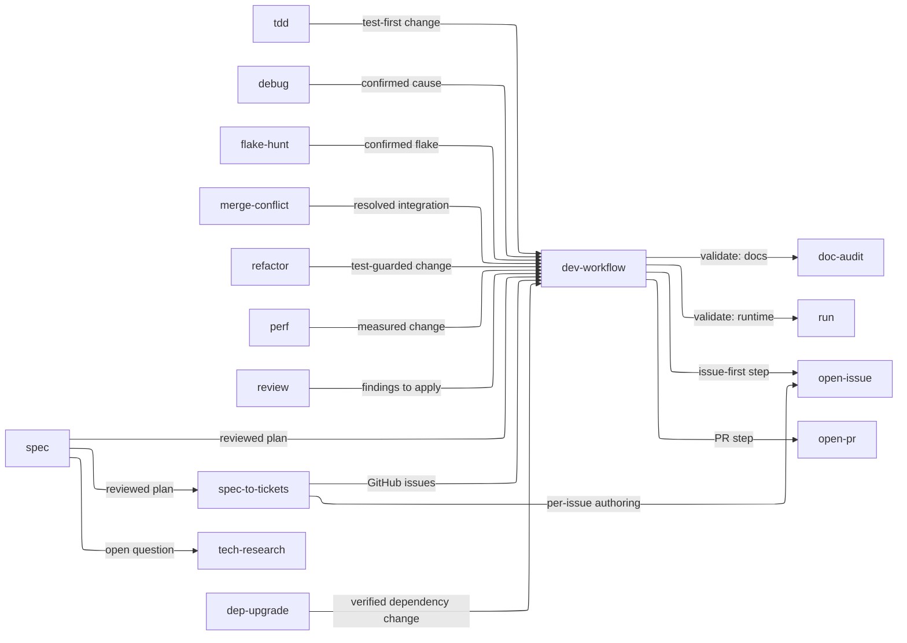

# Engineering skill composition

Which engineering skills are entry points a request lands on, which are components another skill invokes, and who hands off to whom.
An autonomous runner reads this to route a request to the right entry point.

## The graph

```mermaid
%%{init: {'flowchart': {'defaultRenderer': 'elk'}}}%%
flowchart LR
    spec[spec]
    tdd[tdd]
    debug[debug]
    flakehunt[flake-hunt]
    mergeconflict[merge-conflict]
    refactor[refactor]
    perf[perf]
    review[review]
    s2t[spec-to-tickets]
    techresearch[tech-research]
    depupgrade[dep-upgrade]
    devworkflow[dev-workflow]
    docaudit[doc-audit]
    run[run]
    openissue[open-issue]
    openpr[open-pr]

    spec -->|reviewed plan| s2t
    spec -->|reviewed plan| devworkflow
    spec -->|open question| techresearch
    s2t -->|GitHub issues| devworkflow
    s2t -->|per-issue authoring| openissue
    tdd -->|test-first change| devworkflow
    debug -->|confirmed cause| devworkflow
    flakehunt -->|confirmed flake| devworkflow
    mergeconflict -->|resolved integration| devworkflow
    refactor -->|test-guarded change| devworkflow
    perf -->|measured change| devworkflow
    depupgrade -->|verified dependency change| devworkflow
    review -->|findings to apply| devworkflow

    devworkflow -->|issue-first step| openissue
    devworkflow -->|validate: docs| docaudit
    devworkflow -->|validate: runtime| run
    devworkflow -->|PR step| openpr
```

Arrows are runtime hand-offs, where one skill invokes or feeds the next.

Skills left out of the graph:

- `standards` and `design` are model-invoked policy references and never workflow steps, so an edge from each node would repeat one fact. Nearly every skill above reads `standards`. `spec`, `refactor`, `review`, and `tdd` read `design`. `perf` does not read it, because a benchmark guards `perf` instead of a structural judgment.
- `mermaid` is invoked by nearly every skill that writes a diagram, so drawing it would clutter the graph.
- `handoff` hands off to nothing, and nothing hands off to it.
- `prototype` produces design evidence, discards its source, and hands no code to another skill.
- `improve-codebase-architecture` produces a report and waits for the user to select a candidate. It has no runtime hand-off.
- `triage` produces an agent-ready brief for a fleet-style runner and does not feed another skill directly.

Two skills are both entry points and components, and their back edges are omitted to keep the graph acyclic:

- `tdd` hands a change to `dev-workflow`, and `dev-workflow` names `tdd` as the option for building test-first.
- `tech-research` is an entry point `spec` reaches at an open question, and `spec` cites its findings file instead of re-deriving the answer.

## Roles

`user` skills require an explicit command.
`model` skills stay available for automatic selection and composition.

| Skill | Invocation | Role | Lands on it when | Hands off to |
| --- | --- | --- | --- | --- |
| `triage` | user | Entry - inbound intake | An inbound GitHub issue or pull request needs a category, disposition, and agent-ready brief | none (a fleet-style runner consumes the brief) |
| `spec` | user | Entry - planning | A request needs scoping into a reviewed plan before building | `spec-to-tickets` (to file issues) or `dev-workflow` (to execute) |
| `spec-to-tickets` | user | Entry - ticketing | A reviewed spec should become GitHub Issues | `open-issue` (writes and files each one), then `dev-workflow` (executes each issue) |
| `tech-research` | model | Entry - research | A technical question needs a sourced, version-pinned answer about third-party or external behavior | none (produces a findings file); `spec` cites it instead of re-deriving |
| `dep-upgrade` | model | Entry - dependency maintenance | A uv-managed Python project needs a dependency, lockfile, or git-sourced internal tag upgraded | `dev-workflow` (lands the verified dependency change) |
| `tdd` | model | Entry - test-first loop | A request is explicitly test-first ("TDD this", "write the test first", "red, green, refactor") | `dev-workflow` (lands the test-driven change) |
| `debug` | model | Entry - diagnosis | Something is broken and the cause is unknown | `dev-workflow` (lands the fix as a regression-tested change) |
| `flake-hunt` | model | Entry - flake diagnosis | A test failure may be intermittent, order-dependent, seed-dependent, or limited to CI | `dev-workflow` (lands the fix or bounded quarantine) |
| `merge-conflict` | model | Entry - integration recovery | A Git merge or rebase has conflicts that require semantic resolution | `dev-workflow` (resumes validation and the remaining integration workflow) |
| `refactor` | model | Entry - restructuring | Working code needs its structure improved without behavior change | `dev-workflow` (lands the test-guarded change) |
| `perf` | model | Entry - optimization | A change needs to get faster, cheaper, or higher-throughput, and the improvement must be proven with a before/after measurement | `dev-workflow` (lands the measured change) |
| `prototype` | model | Entry - design spike | A design question needs evidence from a disposable implementation | none (produces a decision record and discards the spike) |
| `improve-codebase-architecture` | user | Entry - architecture scan | A codebase needs structural opportunities identified and ranked before implementation | none (produces a visual report and waits for candidate selection) |
| `dev-workflow` | model | Entry and hub | Any request to write and land code in a GitHub repo | invokes `open-issue`, `doc-audit`, `run`, `open-pr`, and `tdd` for an explicitly test-first request |
| `review` | model | Entry - gate | Changes need checking before they land | reports only; findings go to `dev-workflow` to apply |
| `handoff` | user | Entry - utility | A conversation needs compacting for another agent to continue | none (produces a document) |
| `open-issue` | model | Component | `dev-workflow` reaches its issue-first step, `spec-to-tickets` files a work item, or an issue is opened standalone | none |
| `open-pr` | model | Component | `dev-workflow` reaches its PR step, or a PR is opened standalone | none |
| `doc-audit` | model | Component | `dev-workflow` validates, or docs and comments are written standalone | none |
| `run` | n/a | Component - harness-provided, not a skill in this repo | `dev-workflow` validates a change with a runtime surface | none |
| `mermaid` | model | Component | Any skill drafts, renders, or refines a diagram in a doc, spec, PR, or ADR | none |
| `standards` | model | Reference | Any skill applies a house rule | none - read directly |
| `design` | model | Reference | Any skill judges or explains a structural decision | none - read directly |

## Composition rules

- User-invoked skills run only after an explicit command and may compose model-invoked skills. Model-invoked skills stay available for automatic selection and may compose other model-invoked skills, including `dev-workflow`, `open-issue`, and `open-pr`, when the task or repository instruction requires them.
- `improve-codebase-architecture` stops at candidate selection. It grounds structural opportunities in code evidence and the design vocabulary, then leaves interface design and implementation to a later workflow.
- Every skill that produces a code change hands the landing of it to `dev-workflow` instead of opening worktrees or PRs itself.
- Entry points do not run each other's mechanics, and each stays in its lane and hands off:
  - `tdd` drives the red-green-refactor loop and does not touch worktree or PR mechanics.
  - `debug` proves a cause and does not commit.
  - `refactor` and `perf` each prove their own guarantee (an unchanged test suite, a before/after measurement) and do not commit.
  - `dep-upgrade` proves a lockfile and downstream-suite result and does not commit.
  - `review` reports and does not apply.
  - `tech-research` answers a question and does not build.
  - `spec` plans and does not build.
- Components are leaves, except `tdd`. `open-issue`, `open-pr`, `doc-audit`, `run`, and `mermaid` are invoked by another skill and do not hand off further. `tdd` is invoked by a `dev-workflow` step the same way, but as an entry point it hands back to `dev-workflow` instead of terminating there.
- Delegation to a subagent is not a hand-off. `doc-audit` (its language check) and `mermaid` (its render loop) hand work to a subagent, and both stay leaves.
- `standards` and `design` are policy references and never numbered steps. `standards` holds compliance rules and `design` holds structural vocabulary.
- `merge-conflict` completes the active merge or rebase, then returns to `dev-workflow` for remaining validation, publication, or PR lifecycle work.
