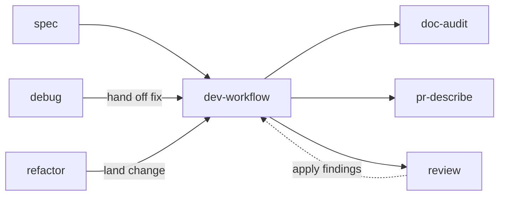

# engineering workflow skills: debug, review, refactor, pr-describe

Status: implemented — see `skills/engineering/{debug,review,refactor,pr-describe}/`.

## Summary

Add four engineering skills that complete the existing `spec → dev-workflow → doc-audit` loop:

- **`debug`** — a reproduce-first bug workflow that produces a confirmed root cause (and optionally a fix), encoding the CLAUDE.md rule that every bug fix starts with an end-to-end reproduction.
- **`review`** — a standards-encoding review of a diff or PR against the user's own engineering bar (lint clean, tests present and green, no flakiness, simplicity over dev cost), distinct from the built-in `/code-review`.
- **`refactor`** — a quality-only cleanup pass that changes structure, not behavior, guarded by tests.
- **`pr-describe`** — an *extraction* of the PR-body conventions currently inlined in `dev-workflow` step 5, so "write the PR description for this branch" works standalone and the conventions have a single source of truth.

All four live under `skills/engineering/` and ship as prose SKILL.md files (no scripts).
They compose with the existing skills rather than duplicating them: `debug` hands off to `dev-workflow` to land the fix, `review` and `refactor` call `dev-workflow` for the isolated-worktree and validation mechanics, and `dev-workflow` calls `pr-describe` for its PR body.

## Requirements

Gathered in the specing interview (2026-07-19):

- **Scope**: four sibling skill folders under `skills/engineering/`. Prose only, no backing scripts (unlike `lit-research`) — these encode judgment and procedure, not API access. One of the four, `pr-describe`, is an extraction from `dev-workflow` rather than net-new material (see "Should dev-workflow be decomposed?" below).
- **They must not duplicate the built-ins.** The environment already ships `/code-review`, `/simplify`, and `/verify`. Each new skill either encodes *the user's specific standards* on top of those or fills a gap the built-ins don't cover (reproduce-first debugging has no built-in).
- **They must compose with the existing chain**, not restate it. Worktree setup, commit staging, PR conventions, and CI-watching all live in `dev-workflow` and must be referenced, never copied.
- **Descriptions carry concrete trigger phrases** in the established house style (a "Use when…" situation clause plus quoted trigger phrases), so model-decided invocation is reliable.
- **Success criteria**: an agent with these installed will (a) refuse to "fix" a bug before reproducing it E2E; (b) review a diff against the user's stated bar and report lint/test/flakiness issues even when incidental; (c) refactor without changing behavior, proven by an unchanged test suite.

## Scope

- **Primary repo**: `skills` (this repo). No other repos affected.
- New files:
  - `skills/engineering/debug/SKILL.md`
  - `skills/engineering/review/SKILL.md`
  - `skills/engineering/refactor/SKILL.md`
  - `skills/engineering/pr-describe/SKILL.md`
- Existing files modified:
  - `skills/engineering/dev-workflow/SKILL.md` — step 5's PR-body conventions move out to `pr-describe`; step 5 slims to a reference (see below).
- Repo files touched:
  - `.claude-plugin/marketplace.json` — add `debug`, `review`, `refactor`, `pr-describe` to the `greerviau-engineering` plugin's `keywords`.
  - `README.md` — add the three skills if it enumerates them (it currently lists engineering skills in prose; update that sentence).
  - `docs/UBIQUITOUS-LANGUAGE.md` — add any terms coined below (e.g. "reproduction", "root cause", "behavior-preserving") if not already present.

## Auto-invocation note

These are model-decided skills: reliability comes from the `description` field, which is the only thing the model sees when choosing.
The separate decision to broaden `spec` and `dev-workflow` triggers (and to optionally add a `UserPromptSubmit` hook for reflexive invocation) applies here too — if `debug` should fire hands-free on phrases like "why is this failing", a hook is the only mechanism that guarantees it independent of the model's attention budget.
This plan ships description-based triggers only; a hook is a follow-up.

## Should `dev-workflow` be decomposed?

`dev-workflow` is a linear, disciplined sequence: worktree → work → validate → publish → PR → CI → cleanup.
Most of its value is the *glue between steps* ("don't stop at the PR, watch CI to green"; "clean up the worktree after"), so shattering it into seven independent skills would destroy the discipline while multiplying frontmatter and triggers that all fire together anyway.

The right test for extraction is: **does this step get invoked *outside* a full build cycle?**
Applying it:

| Step | Standalone trigger surface? | Verdict |
|---|---|---|
| Worktree setup | Rarely alone | Keep inline |
| Do the work | The whole point | Keep |
| Validate | Already composes `doc-audit` + `verify` | Keep as orchestration |
| Publish | Trivial | Keep inline |
| PR body | Yes — "write the PR description for this branch" | **Extract → `pr-describe`** |
| Watch CI | Plausibly — "babysit this PR to green" | Follow-up → `ci-watch` |
| Cleanup | Trivial, coupled to worktree | Keep inline |

This is the same pattern `dev-workflow` already follows: it extracts `doc-audit` and `verify` and calls them as sub-skills because they are independently triggerable and reusable.
`pr-describe` and (later) `ci-watch` are the two remaining steps that clear the same bar.
`dev-workflow` stays the orchestrating spine and *references* the extractions; it does not re-implement them.

## Approach / design

### `debug`

**Purpose.** Turn a bug report into a confirmed root cause, then hand off to `dev-workflow` to land the fix. The defining rule (straight from CLAUDE.md): reproduce end-to-end, as close to how a user hits it as possible, *before* forming any fix hypothesis. This is what stops "fixes" that address a symptom the real bug doesn't even go through.

**Procedure.**
1. **Reproduce.** Build the smallest reliable E2E reproduction that exercises the bug the way an end user does — drive the real entry point, not an isolated unit. If it can't be reproduced, that is the finding: report what was tried and ask for missing detail rather than guessing at a fix.
2. **Localize.** With a red repro in hand, narrow to the root cause — bisect, add instrumentation, read the failing path. Distinguish the symptom from the cause.
3. **Confirm.** State the root cause and how the reproduction proves it.
4. **Fix (optional).** If asked to fix, hand off to `dev-workflow`: the fix lands on an isolated worktree, the reproduction becomes a regression test (E2E-first per house style), and it goes through the normal validate → PR → CI flow.

**Boundaries.** `debug` finds and proves the cause; `dev-workflow` lands the change. `debug` does not open worktrees or PRs itself — it composes.

**Description (draft).**
> Use when something is broken and the cause is unknown — a failing test, a crash, wrong output, a user-reported bug. Reproduces the bug end-to-end the way a user hits it *before* forming any fix hypothesis, localizes the root cause, and proves it with the reproduction; hands off to dev-workflow to land the fix as a regression-tested change. Trigger on "why is this failing", "reproduce this bug", "track down", "debug this", "what's causing", "it's broken when".

### `review`

**Purpose.** Review a diff, branch, or PR against *the user's* engineering bar, not a generic checklist. It encodes standards already stated in CLAUDE.md so they're applied consistently: lint must be clean, tests must exist and pass, flakiness is a defect, and correctness/simplicity/maintainability outweigh development cost. Explicitly complements — does not replace — the built-in `/code-review` (which hunts correctness bugs) by adding the standards layer and the "fix it even if incidental" rule.

**Procedure.**
1. **Scope the diff.** Identify what changed (working tree, branch vs. base, or a GitHub PR).
2. **Correctness pass.** Defer to `/code-review` for deep bug-hunting where useful; summarize, don't re-derive.
3. **Standards pass.** Check against the encoded bar: lint clean, tests present and E2E-weighted, no introduced flakiness, no needless complexity, docs audited (`doc-audit`), ubiquitous-language terms used verbatim.
4. **Incidental-defect rule.** Per CLAUDE.md: if a lint error, test failure, or flakiness is spotted even when unrelated to the change, flag it — and note it belongs on its own branch, not this one.
5. **Report.** Findings ranked most-severe first, each actionable, with a clear ship / don't-ship call.

**Boundaries.** Reviews and reports; does not itself land fixes. If asked to apply findings, hand off to `dev-workflow`.

**Description (draft).**
> Use when reviewing changes before they land — a working-tree diff, a branch, or a GitHub PR — against the user's own engineering standards (lint clean, tests present and green, no flakiness, simplicity and correctness over development cost). Complements the built-in code review by adding the standards layer and flagging incidental lint/test/flakiness defects even when unrelated. Trigger on "review this", "review my changes", "look over this PR", "check this before I push", "is this ready to ship".

### `refactor`

**Purpose.** Improve structure without changing behavior — reduce duplication, clarify naming, simplify control flow, align with conventions — guarded by an unchanged test suite. Distinct from the built-in `/simplify` (a one-shot cleanup of the current diff) by being a deliberate, test-guarded pass the user can point at any code, with behavior-preservation as the hard invariant.

**Procedure.**
1. **Establish a safety net.** Confirm the affected code has passing tests; if coverage is thin, add characterization tests capturing current behavior *before* touching structure.
2. **Refactor in small behavior-preserving steps**, keeping tests green throughout. No functional change rides along — if a bug surfaces, flag it for a separate branch (do not fix it here).
3. **Validate.** Full test suite green and unchanged in intent; lint clean; `verify` the runtime surface if there is one.
4. **Land via `dev-workflow`** — isolated worktree, staged commits, PR whose description makes the behavior-preserving guarantee explicit.

**Boundaries.** Behavior is the invariant. Any change that alters observable behavior is out of scope and belongs in `dev-workflow` (feature) or `debug` (fix).

**Description (draft).**
> Use when improving the structure of working code without changing its behavior — reducing duplication, clarifying names, simplifying control flow, aligning with conventions — guarded by an unchanged test suite. Adds characterization tests first when coverage is thin, refactors in small behavior-preserving steps, and lands via dev-workflow. Trigger on "clean this up", "refactor this", "reduce duplication", "simplify this code", "tidy up", "make this more maintainable".

### `pr-describe`

**Purpose.** Own the PR-body conventions currently inlined in `dev-workflow` step 5, so they have a single source of truth and can be invoked standalone ("write the PR description for this branch") without running a full build cycle. This is the extraction identified above, and it is where the CLAUDE.md rules on PR prose live: no AI attribution of any kind, no agent co-author lines, no volatile details (version bumps) that go stale.

**Procedure.**
1. **Scope the branch.** Diff against the base to see what actually changed.
2. **Write an evergreen body** covering: Problem / request, Intent, Changes, Testing, Additional testing required, Regressions. Follow the repo's PR template if one exists, adding what's valuable.
3. **Enforce the exclusions**: no "generated by" notes, no co-author lines, no narrow version details.

**Boundaries.** Produces the body text only; does not open the PR, push, or watch CI — `dev-workflow` does that and calls this skill for step 5.

**`dev-workflow` step 5 after extraction.** Step 5 slims from the full convention list to: *"Write the PR body per the `pr-describe` skill; do not stop here — wait and watch CI."* The title convention (`feat(...)`, `fix(...)`) and the "don't stop, watch CI" hand-off stay in `dev-workflow` because they belong to the orchestration, not the body.

**Description (draft).**
> Use when writing or rewriting a pull request description — standalone ("write the PR description for this branch") or as the body step of the dev workflow. Produces an evergreen body (Problem, Intent, Changes, Testing, Additional testing required, Regressions) with no AI attribution, no co-author lines, and no volatile version details. Trigger on "write the PR description", "describe this PR", "PR body for this branch", "summarize this branch for a PR".

## How they compose

`debug` and `refactor` feed *into* `dev-workflow`; `review` sits *after* it (and can loop back); `pr-describe` is a sub-skill `dev-workflow` calls for its PR body, the same relationship it already has with `doc-audit` and `verify`. None of the new skills re-implement worktrees, commits, or CI — that stays in one place.

## Rejected alternatives

- **Folding `debug` into `dev-workflow`.** Rejected: reproduce-first debugging is a distinct mode with its own trigger surface ("why is this failing") that has no build intent yet. Keeping it separate lets it fire before any decision to write code.
- **Skipping `review`/`refactor` in favor of the built-ins.** Rejected: `/code-review` and `/simplify` are generic; the value here is encoding the user's specific standards (incidental-defect rule, E2E-test weighting, behavior-preservation invariant) so they apply without restating them each time.
- **Backing scripts.** Rejected: these are judgment/procedure skills, not API-access skills. No deterministic tooling to extract.
- **Shattering `dev-workflow` into per-step skills.** Rejected: the value is the disciplined sequence, not the steps. Only steps with standalone trigger surface are extracted (`pr-describe` now; `ci-watch` as a follow-up).

## Follow-ups

- **`ci-watch`** — extract the "watch CI to green" step (step 6) if "babysit this PR to green" becomes a phrasing used outside a full build. Same extraction bar as `pr-describe`; deferred until the standalone need is real.

## Open questions

- Should `review` support a `--fix` style hand-off that applies findings automatically (mirroring `/code-review --fix`), or always stop at reporting? Current draft: report only, hand off to `dev-workflow`.
- Does `README.md` enumerate skills granularly enough to need per-skill lines, or is the prose sentence sufficient? Confirm at implementation.
