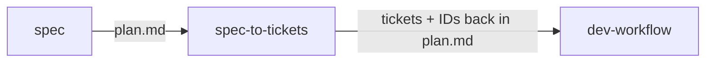

# spec-to-tickets skill

Status: implemented — see `skills/engineering/spec-to-tickets/`. v1 ships prose adapters (GitHub via inline `gh` commands, Linear/Trello via MCP/API); dedicated backing scripts are deferred (see Follow-ups).

## Summary

Add one engineering skill, `spec-to-tickets`, that turns a reviewed spec (the markdown a `spec` run produces) into concrete tickets in the user's ticket tracker.
It is an **explicit** skill — invoked deliberately, not fired reflexively — and it **hard-requires a configured tracker** before it will do anything: it reads a stored tracker variable and refuses to run if none is set, telling the user how to set it.

It sits between `spec` and `dev-workflow` in the chain: `spec` produces the plan, `spec-to-tickets` breaks it into trackable work items, `dev-workflow` executes them.

## Requirements

Gathered in the specing interview (2026-07-19):

- **One skill folder**: `skills/engineering/spec-to-tickets/`. Prose SKILL.md; a small backing script only for the trackers that warrant deterministic tooling (see Approach).
- **Explicit invocation only.** This creates external, hard-to-reverse artifacts (tickets other people see), so it must never fire on its own. No reflexive triggers — it runs on `/spec-to-tickets` or an unmistakable request ("turn this spec into tickets").
- **Hard tracker precondition.** The skill's first action is to resolve the configured tracker. If none is configured, it stops and instructs the user to set one — it does not guess, and it does not fall back to a default tracker.
- **Multi-tracker.** Support GitHub Issues, Linear, and Trello at minimum, with room to add Jira and others. The tracker choice is data (a config value), not branches hardcoded in the skill.
- **Preserve the spec.** Tickets must use the spec's ubiquitous-language terms verbatim, link back to the spec document, and mirror its structure (parent/epic + child tickets).
- **Idempotent-ish.** Re-running against a spec that already has tickets must not silently duplicate them.
- **Scope-driven output shape.** The skill reads the spec's weight and chooses whether to create a single ticket, a few flat tickets, or a parent with sub-issues — asking the user only when the choice is genuinely ambiguous. It does not always produce a parent-plus-children tree.
- **Success criteria**: given a reviewed spec and a configured tracker, the skill picks a ticket shape appropriate to the spec's scope (single / flat / parent+sub-issues), creates the tickets each linked to the spec and using its vocabulary, and records the created ticket IDs back in the spec so a re-run is safe.

## Scope

- **Primary repo**: `skills` (this repo).
- New files:
  - `skills/engineering/spec-to-tickets/SKILL.md`
  - `skills/engineering/spec-to-tickets/scripts/` — only for trackers needing deterministic CLI/API glue (GitHub via `gh`; Linear/Trello via `uv`-run API scripts). See Approach.
- Repo files touched:
  - `.claude-plugin/marketplace.json` — add `spec-to-tickets` to the `greerviau-engineering` plugin's `keywords`.
  - `docs/UBIQUITOUS-LANGUAGE.md` — add terms coined here ("tracker", "work item", "parent ticket") if absent.
  - `README.md` — add the skill if it enumerates them.

## The tracker variable

The skill reads a **tracker config** that names which tracker to use and how to reach it. Resolution order:

1. **Repo-scoped**: `.claude/ticket-tracker.yml` at the repo root (recommended primary — trackers are almost always project-scoped: a repo maps to one GitHub repo, one Linear team, one Trello board).
2. **Global fallback**: `~/.claude/ticket-tracker.yml` (for users with a single personal tracker across projects).

If neither exists, the skill **stops** and prints how to create one. It never assumes a tracker.

Shape (example):

```yaml
tracker: github            # github | linear | trello | jira
github:
  repo: greerviau/skills   # owner/repo for gh issue create
linear:
  team: ENG                # team key; auth via LINEAR_API_KEY env or Linear MCP
trello:
  board_id: abc123         # auth via TRELLO_KEY / TRELLO_TOKEN env
```

Only the block matching `tracker:` is required. Secrets stay in env vars, never in the file (the file is safe to commit; `.gitignore` guidance in SKILL.md for the global one).

## Approach / design

### Adapter shape, not branchy prose

The SKILL.md describes a single procedure — parse spec → build the ticket tree → create via the configured adapter — and delegates the per-tracker mechanics to a named adapter section. Adding a tracker means adding an adapter block, not rewriting the flow.

Per-tracker mechanics:
- **GitHub Issues** — deterministic and scriptable via the `gh` CLI (`gh issue create`, `gh sub-issue`/task-list linking). A thin script is worth it here.
- **Linear** — via the Linear MCP server if present, else a small `uv`-run API script. Parent/child via issue relations.
- **Trello** — `uv`-run API script; parent → a card or checklist, children → cards or checklist items on a board list.

Where a deterministic script exists it is preferred over prose curl instructions (same rationale as `lit-research`).

### Spec → ticket mapping

The shape of the output is **driven by the scope of the spec**, not a fixed parent-plus-children template. The skill first reads the whole spec and judges its weight, then picks one of three shapes:

- **Single ticket** — a small, self-contained spec (one-file bug fix, a lone change). One issue captures it; no parent, no children.
- **A few flat tickets** — a spec with a handful of independent work items that don't need a coordinating parent. Create them as siblings.
- **Parent + sub-issues** — a large or multi-part spec (cross-file, cross-repo, staged rollout). A parent/epic captures the whole, children capture each work item.

**Deciding the shape.** The signal comes from the spec's own structure — the number of distinct work items under "Scope" and "Approach / design", whether it spans multiple repos, and whether the steps have ordering/dependencies that a parent would coordinate. The skill proposes a shape with its reasoning.

**When it's ambiguous, ask.** If the weight sits on the boundary (e.g. three-to-five loosely related items that could be flat siblings *or* a small epic), the skill does not silently pick — it presents the candidate shapes and asks the user to choose before creating anything. A clearly-small or clearly-large spec is decided without a question; only genuine ambiguity prompts one.

Regardless of shape:
- **Titles/bodies** use the spec's ubiquitous-language terms, verbatim.
- **Every ticket links back** to the spec document.
- **Nothing is created until the user confirms** the proposed shape and breakdown (explicit, reversible-at-the-boundary).

### Idempotency

After creation, the skill writes a **"Tickets" section back into the spec doc** listing each work item → its ticket ID/URL.
On re-run it reads that section first: existing items are skipped (or offered for update), only new items are created. This prevents the duplicate-flood failure mode of re-running.

### Preflight (the hard requirement in action)

1. Resolve tracker config (repo, then global). **Missing → stop and instruct.**
2. Verify auth for the resolved tracker (env vars / MCP / `gh auth status`). **Missing → stop and instruct.**
3. Only then parse the spec, judge its scope, and propose a ticket shape (asking the user if the shape is ambiguous).

## How it composes

`spec` writes the plan → `spec-to-tickets` turns it into tracked work items → `dev-workflow` executes each, referencing its ticket in commits/PRs.
The spec doc is the shared artifact across all three: `spec` creates it, `spec-to-tickets` annotates it with ticket IDs, `dev-workflow` reads both.



## Description (draft)

> Use when turning a reviewed spec into tickets in your tracker — explicitly, never automatically, since it creates work items other people see. Requires a configured tracker (`.claude/ticket-tracker.yml` in the repo, or `~/.claude/ticket-tracker.yml` globally) and refuses to run without one. Reads the spec, judges its scope to pick a ticket shape (a single ticket, a few flat tickets, or a parent with sub-issues) using the spec's own vocabulary and asking when the shape is ambiguous, creates them in GitHub Issues / Linear / Trello via the configured adapter, and records the ticket IDs back in the spec so re-runs don't duplicate. Trigger on "/spec-to-tickets", "turn this spec into tickets", "create tickets/issues for this plan", "file tickets for this".

## Rejected alternatives

- **Reflexive invocation (auto-fire after `spec`).** Rejected: creating external tickets is a high-consequence, outward-facing action that must be user-initiated.
- **A default tracker when none is configured.** Rejected: the whole point is that the tracker is an explicit stored variable; guessing would file tickets in the wrong place.
- **One skill per tracker** (`spec-to-github`, `spec-to-linear`, …). Rejected: the flow is identical; the tracker is data. One skill with adapters, chosen by the config value.

## Open questions

- Ticket granularity *within* the chosen shape: one child per Scope file, per Approach step, or user-chosen each run? Current draft: skill proposes, user confirms before creating.
- Where to draw the single / flat / parent+sub-issues thresholds — a heuristic (item count, repo count) vs. left to the skill's judgment each run? Current draft: judgment, guided by the signals listed in "Deciding the shape", with a question only on genuine ambiguity.
- Should the "Tickets" back-reference section live in the spec doc (current draft) or a sidecar file? Doc keeps it with the plan; sidecar keeps the plan clean.

## Follow-ups

- **Backing scripts** — v1 ships prose adapters (GitHub via inline `gh` commands, Linear/Trello via MCP/API). Promote to deterministic `uv`-run scripts under `scripts/` once the API adapters have been exercised enough to lock down.
- **Jira adapter** — add once a user needs it; the adapter shape already leaves room.
- **Status sync** — reflect ticket state back into the spec (or vice versa) after `dev-workflow` lands work. Out of scope for the first pass.
