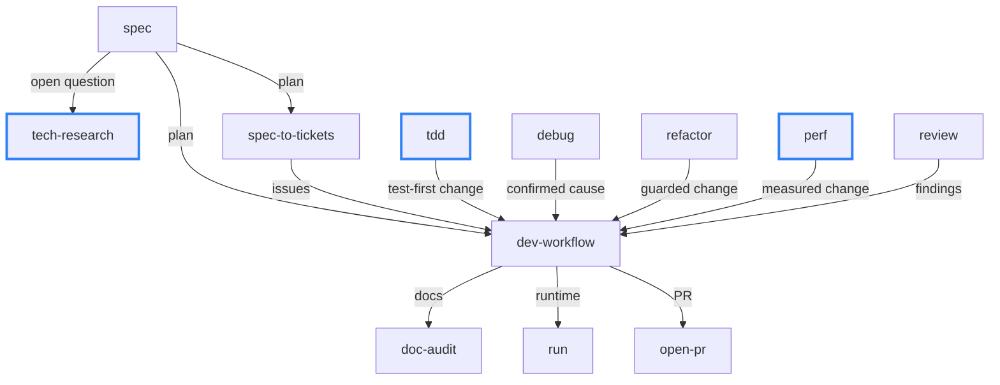

# engineering skills expansion: design, tdd, tech-research, perf, mermaid

Status: proposed. Each Tier 1 skill below needs its own spec before implementation.

## Summary

The engineering plugin currently covers the plan/build/land/verify loop: `spec`, `spec-to-tickets`, `dev-workflow`, `open-pr`, `doc-audit`, `debug`, `refactor`, `review`, `handoff`, with `standards` as the shared policy reference.
This plan scopes the next wave, drawn from a gap analysis against [mattpocock/skills `skills/engineering`](https://github.com/mattpocock/skills/tree/main/skills/engineering) plus the parts of the day-to-day workflow the current set leaves unaddressed.

Tier 1, in recommended order:

- **`design`** - a second policy reference alongside `standards`, holding the vocabulary for *what good structure is* (module depth, information hiding, seam placement, testability). Consumed by `spec`, `refactor`, and `review`, all three of which currently assert "simplicity" with no operational definition.
- **`tdd`** - the test-first loop as an entry point: choose the seam, write the failing end-to-end test, watch it fail for the right reason, minimum code to green, refactor under green. Hands off to `dev-workflow` to land.
- **`tech-research`** - the engineering twin of `research/lit-research`: investigate a technical question against primary sources (vendor docs, the installed dependency's source, RFCs) and capture findings with citations and per-claim confidence.
- **`perf`** - measure-first optimization: baseline with a reproducible harness, profile before hypothesizing, change one thing, re-measure, keep the harness. Structurally `refactor` but guarded by a benchmark instead of a test suite.
- **`mermaid`** - the render-and-refine loop for diagrams: draft, render to an image, look at the layout, critique, refine, repeat. `standards` already forbids one-shotting a mermaid diagram and suggests delegating to a subagent, but supplies no procedure, so the rule is currently unenforceable. Smallest of the five and the first to land.

Tier 2 candidates are listed under [Deferred candidates](#deferred-candidates) with enough rationale to spec later.
Two improvements fall out of the same analysis but are edits to existing skills rather than new ones; see [Non-skill fixes](#non-skill-fixes).

## Requirements

- **No duplication of the existing set or the built-ins.** Every proposal either fills a hole in the composition graph or encodes a house standard the built-ins do not know about. The gap analysis below records what was rejected as duplicate.
- **Composition over restatement.** Worktree mechanics, commit staging, PR conventions, and CI-watching live in `dev-workflow`; testing/doc/PR policy lives in `standards`. New skills reference them and never copy them.
- **Policy and procedure stay separated.** `standards` proved the pattern: a reference skill states rules, an entry-point skill supplies the procedure that applies them at the right moment. `design` follows the same split.
- **Descriptions carry concrete trigger phrases** in the established house style (a "Use when ..." situation clause plus quoted triggers), so model-decided invocation is reliable.
- **Each skill declares its interaction mode** per the contract in `standards`, degrading to a defensible default plus a recorded assumption when run autonomously.
- **Success criteria**: an agent with these installed will (a) justify a structural change in the vocabulary of `design` rather than by taste; (b) refuse to claim test-driven work when the implementation came first; (c) never assert an API fact without a primary source and a confidence level; (d) refuse to call an optimization successful without a before/after measurement from the same harness; (e) never commit a mermaid diagram it has not rendered and looked at.

## Scope

- **Primary repo**: `skills` (this repo). No other repos affected.
- New skill folders under `skills/engineering/`: `design`, `tdd`, `tech-research`, `perf`, `mermaid`.
- Existing files modified:
  - `skills/engineering/standards/SKILL.md` - the mermaid bullet points at the `mermaid` skill for the procedure instead of gesturing at "refine it until it reads well".
  - `skills/engineering/refactor/SKILL.md` and `skills/engineering/review/SKILL.md` - reference `design` for the definition of better structure instead of leaving it implicit.
  - `skills/engineering/spec/SKILL.md` - reference `design` in the approach/design section of a plan.
  - `skills/engineering/spec-to-tickets/SKILL.md` - add `disable-model-invocation: true` (see [Non-skill fixes](#non-skill-fixes)).
  - `skills/engineering/review/SKILL.md` - add the spec-conformance axis (see [Non-skill fixes](#non-skill-fixes)).
  - `docs/engineering-skill-composition.md` - update the graph and role table.
  - `.claude-plugin/marketplace.json` - add the new skill names to the `greerviau-engineering` keywords and refresh the plugin description.
  - `README.md` - add an entry per new skill in the engineering list.
  - `docs/UBIQUITOUS-LANGUAGE.md` - add the terms each skill coins (candidates: deep module, seam, characterization test is already implied by `refactor`, baseline, harness, primary source, confidence level).
- **Out of scope**: any skill in [Deferred candidates](#deferred-candidates), and the mattpocock skills rejected as duplicates below.

## Gap analysis against mattpocock/skills

Rejected as already covered:

| Theirs | Ours | Note |
| --- | --- | --- |
| `implement` | `dev-workflow` | Same role; ours additionally owns worktrees, CI-watching, and PR lifecycle. |
| `diagnosing-bugs` | `debug` | Same reproduce-first loop. |
| `to-spec`, `to-tickets` | `spec`, `spec-to-tickets` | `to-spec` skips the interview; our `spec` interviews by design, and skipping it is a mode of `spec`, not a sibling skill. |
| `code-review` | `review` | Their two-axis split is worth stealing as an edit to `review`, not a new skill. |
| `research` | `research/lit-research` | Ours is science-only. The engineering half is the `tech-research` gap. |
| `resolving-merge-conflicts` | none | Genuine gap, but small; deferred. |
| `wayfinder` | `spec` plus `spec-to-tickets` | Deferred; see rationale below. |
| `grill-with-docs` | `spec`'s interview step | Only worth extracting if a second skill needs the same adversarial interview. |
| `improve-codebase-architecture` | none | Blocked on `design`; without the vocabulary the scan produces taste, not findings. |

Adopted as Tier 1: `codebase-design` becomes `design`, `tdd` stays `tdd`, `research` becomes `tech-research`.
Adopted as Tier 2: `triage`, `prototype`.
Net-new, not from their set: `perf` and `mermaid`.

## Approach and design

### `design`

A reference skill, peer to `standards`, read rather than invoked.
It holds the vocabulary and the trade-off rules for structural decisions:

- **Module depth**: interface surface area weighed against the functionality hidden behind it; shallow pass-through layers as the primary smell.
- **Information hiding**: what a caller is forced to know, and which leaks are load-bearing versus accidental.
- **Seam placement**: where the public boundary sits, and the consequence that the seam is also where tests attach. This is the hinge that makes `design` and `tdd` reinforce each other.
- **Error-condition elimination**: designing away an error case beats propagating it.
- **Navigability**: naming and locality so both a human and an agent can find the code that owns a concept, which connects to the ubiquitous-language rule in `standards`.

Why it ranks first: `refactor` justifies a change as "aligning with conventions" and `review` judges "simplicity and maintainability over development cost". Neither term is defined anywhere in the repo, so today both resolve to whatever the model finds tasteful in the moment. `design` makes those judgments citable and reviewable.

Boundaries: states rules, never appears as a numbered step, produces no artifact of its own.

### `tdd`

An entry point that also serves as a component `dev-workflow` can invoke when a change is being built test-first.
Procedure, in outline:

1. **Pick the seam.** Per `design`, and per the E2E bias in `standards`: drive the real entry point (CLI, endpoint, flow), not an internal helper.
2. **Build the harness if it does not exist.** When there is no fixture, no runner, or no way to drive the seam, building that is step zero and lands as its own commit. This is the step that most often gets skipped, and skipping it is what pushes tests down to whatever unit is convenient.
3. **Red.** Write one failing test that expresses the desired behavior. Run it. Confirm it fails *for the intended reason*, not on an import error or a missing fixture.
4. **Green.** Minimum implementation to pass. No extra scope.
5. **Refactor under green.** Hand structural cleanup to `refactor` when it grows beyond a tidy-up.
6. Repeat per behavior, then hand off to `dev-workflow` to stage, validate, and land.

Explicit prohibition: writing the implementation first and the test afterward is not this skill, and describing that sequence as test-driven is a reporting failure. The skill states this directly because it is the dominant failure mode when an agent runs the loop unsupervised.

Relationship to `debug`: `debug` already produces a failing reproduction, which is a red test by another name. `tdd` covers the feature case; `debug` keeps the bug case. Each references the other rather than absorbing it.

Policy stays in `standards` (E2E bias, regression test from the reproduction, flakiness is a defect). `tdd` supplies only the loop.

### `tech-research`

Investigate a technical question against high-trust primary sources and capture the answer as a durable markdown file.

- **Source hierarchy, stated explicitly**: the installed dependency's own source and tests, then official vendor documentation for the pinned version, then specifications and RFCs, then release notes and issue trackers, then everything else. Blog posts and model recall are not sources.
- **Per-claim confidence** (high/moderate/low/unknown) and a citation per claim, matching the global rule that facts are verified and uncertainty is labeled rather than smoothed over.
- **Version-pinned answers.** An API fact is about a version; the findings file records which one.
- **Durable output** in the repo (default `docs/analysis/`, consistent with the `github` directory convention), so `spec` can cite it instead of re-deriving it.
- Delegates breadth to background agents where the question decomposes.

Why it earns a slot: it is the mechanism behind the "never hallucinate, always give confidence levels" rule. Today that rule is a hope; a skill makes it a procedure with an artifact attached.

### `perf`

Measure-first optimization, guarded by a benchmark the way `refactor` is guarded by a test suite.

1. **State the target.** Latency, throughput, or cost, with a number and a workload. "Faster" is not a target.
2. **Build the harness and take a baseline.** Reproducible, committed, and cheap enough to re-run. A one-off timing in a shell is not a baseline.
3. **Profile before hypothesizing.** The bottleneck is measured, never guessed.
4. **Change one thing.** Behavior stays fixed; the test suite must stay green, which is the boundary against a smuggled behavior change.
5. **Re-measure on the same harness** and report before/after with the workload named.
6. **Keep the harness** so the next regression is detectable, then hand off to `dev-workflow`.

Why net-new: nothing in the current set has a notion of cost or speed. `dev-workflow` validates correctness only, so an optimization lands today with no evidence it optimized anything. Pipeline and dataset-build work is where this bites in practice, which makes `perf` the fastest of the four to pay for itself even though `design` is the larger structural fix.

Interaction mode: autonomous runs report the measured delta and refuse to declare success on an unmeasured change.

### `mermaid`

A component skill, invoked by anything that writes a diagram into markdown: `spec`, `design`, `doc-audit`, `open-pr`, ADRs, READMEs.
`standards` already carries the policy ("favor mermaid over ASCII", "don't one-shot a mermaid diagram, refine it until it reads well, using subagents if needed") with no procedure attached, which makes it a rule nothing can enforce.

The loop:

1. **Draft** the diagram from its intent, stated in one sentence ("show where the new skills attach to the existing hand-off graph").
2. **Render** it to an image locally and **look at the image**. This is the non-negotiable step: layout defects are invisible in source.
3. **Critique** against the layout checklist below.
4. **Refine and re-render** until it passes. One render is the floor, not the target.

Layout checklist, derived from the five-render session that produced the diagram in this plan:

- **`direction` inside a subgraph is ignored when an edge crosses the subgraph boundary.** A `direction TB` group silently lays out horizontally and sprawls the whole diagram sideways. This trap alone cost two renders.
- **A subgraph box forces its children into a stack** and usually buys dead space next to it. Drop the box unless the grouping *is* the message; ranks already communicate stages.
- **Aspect ratio between about 4:3 and 16:9.** A 5:1 sprawl or a 1:3 column means the structure is wrong, not the styling.
- **Edge labels stay at one to three words.** Label width drives node spacing, so a long label pushes the whole layout apart.
- **A skip edge spanning more than two ranks sweeps the margin.** Either restructure or accept exactly one.
- **Reverse an edge when it flattens a rank without changing meaning.** `spec -->|open question| tech-research` says the same thing as the reverse and removes a rank.
- **Zero crossings.** A crossing means the rank assignment is wrong, not that the diagram is inherently complex.
- **Theme-neutral styling only:** stroke-based `classDef`, never `fill`, because GitHub renders both light and dark.

Mechanics: render with the local mermaid CLI (`npx -y -p @mermaid-js/mermaid-cli mmdc -i d.mmd -o d.png -b white -s 2`), first run pays a one-time Chromium download.
Working `.mmd` and `.png` files live in the scratchpad and are never committed; only the final fenced block lands in the document.
Hosted renderers such as mermaid.ink are out, since they publish the diagram content to a third party.

Delegation, which is where the token argument bites: hand the intent plus the checklist to a subagent and have it return only the final mermaid source.
The renders and intermediate images stay in the subagent's context.
Producing the one diagram in this plan cost five renders and five image reads inline; that is exactly the cost a subagent should absorb.

Boundaries: does not decide *whether* a diagram belongs (that is the `standards` rule) and does not touch the surrounding prose.

## How they compose

Runtime hand-offs in the target state, with the new skills outlined:

Reading notes, kept in prose rather than drawn, because adding them as edges turns the graph into a hairball:

- **`standards` and `design` are policy references**, read by every skill above and never a step in any of them. They have no edges by design; the role table in `docs/engineering-skill-composition.md` records which skill reads which.
- **`tdd` doubles as a component.** It is drawn as an entry point handing a change to `dev-workflow`, and `dev-workflow` invokes it in turn when a change is built test-first. The back edge is omitted to keep the graph acyclic.
- **`mermaid` is a component of every skill that writes a diagram**, so it attaches everywhere and is drawn nowhere.
- **`handoff` has no runtime edges** and is omitted; it produces a document and hands off to nothing.

## Non-skill fixes

Two findings from the same analysis are edits, not new skills, and can land ahead of the Tier 1 work.

1. **`spec-to-tickets` is model-invocable despite its own description.** Its description says it should be used "explicitly, never automatically, since it creates work items other people see", yet only `handoff` sets `disable-model-invocation: true`. The description is documentation; the frontmatter flag is enforcement. Set the flag.
2. **`review` has no spec-conformance axis.** It checks the diff against the standards bar but never against what the originating spec or issue asked for, so a well-built change that solves the wrong problem passes. Add a second axis that reads the originating spec/issue and reports scope drift, missing requirements, and out-of-scope additions, run as a parallel sub-agent alongside the standards pass.

## Deferred candidates

Each needs its own spec if promoted; recorded here so the rationale is not re-derived.

- **`triage`** - inbound issues and external PRs to a category plus an agent-ready brief. The mirror image of `spec-to-tickets`, which is outbound. Value is highest if fleet-style runners consume briefs as their input format, since that translation is currently ad hoc.
- **`adr`** - `standards` explicitly exempts ADRs from the present-tense rule, but no skill produces one and the repo has no location convention for them. Cheap; a candidate to fold into `design` rather than stand alone.
- **`flake-hunt`** - `standards` declares flakiness a defect without supplying a procedure. Would cover rerun-N, seed and order bisection, "is CI red from this diff or from the base", and a quarantine policy.
- **`dep-upgrade`** - uv-only dependency work: lockfile discipline, lockstep tag bumps for git-sourced internal packages, and verification by running the downstream suite rather than the upgraded package's own.
- **`prototype`** - a throwaway spike that answers a design question and is explicitly never landed. The value is the boundary; the failure mode it prevents is a prototype accreting into main.
- **`map-subsystem`** - read a subsystem and emit a durable map document. The built-in `Explore` agent covers the reading; nothing makes the output persist.
- **`merge-conflict`** - small but real given long-lived worktrees and evergreen PRs: rebase-versus-merge policy, resolve semantically rather than textually, re-run the suite after.
- **`wayfinder` analog** - planning work larger than one agent session as a map of decision tickets. Deferred deliberately: `spec` plus `spec-to-tickets` handles the current scale of work, and building this now is building for unfelt pain.
- **`improve-codebase-architecture` analog** - scan a codebase for structural opportunities and rank them. Blocked on `design`; revisit once the vocabulary exists.

## Steps

1. Land the two [Non-skill fixes](#non-skill-fixes). Independent of everything below.
2. Spec and implement `mermaid`, then point the `standards` mermaid bullet at it. First because it is the smallest and because every later step writes diagrams.
3. Spec and implement `design`, then update `refactor`, `review`, and `spec` to reference it.
4. Spec and implement `tdd`, wiring the seam concept to `design` and the policy to `standards`.
5. Spec and implement `tech-research`.
6. Spec and implement `perf`.
7. After each: update `docs/engineering-skill-composition.md`, `README.md`, `.claude-plugin/marketplace.json`, and `docs/UBIQUITOUS-LANGUAGE.md` in the same change.

## Testing and verification

- Each new skill is exercised on a real task in a real repo before it is considered done, not just read for plausibility.
- `design` is verified indirectly: a `refactor` or `review` run after it lands should cite its vocabulary for a structural claim rather than asserting taste.
- `tdd` is verified by checking commit order on a task run with it: the failing test commit precedes the implementation.
- `tech-research` is verified by auditing a findings file for a citation and a confidence level on every claim.
- `perf` is verified by confirming the harness is committed and the before/after numbers come from the same workload.
- `mermaid` is verified against a deliberately bad diagram: hand it a subgraph-with-crossing-edges sprawl and confirm the loop renders it, names the defect from the checklist, and returns a restructured version rather than a restyled one.

## Risks and open questions

- **Skill sprawl dilutes retrieval.** Every added skill competes for model-decided invocation, so overlapping trigger surfaces make all of them fire less reliably. `design` and `tdd` both talk about seams; their descriptions must partition cleanly (policy versus loop).
- **Does `design` belong inside `standards`?** Argument for merging: one policy reference is simpler than two. Argument for splitting, which this plan takes: `standards` is a rule list an agent complies with, `design` is a vocabulary an agent reasons in, and mixing them makes the compliance checklist unusable.
- **Does `tdd` overlap `debug` enough to merge?** Both produce a red test first. Kept separate because the trigger surfaces are disjoint (new behavior versus broken behavior) and merging would bury one procedure inside the other.
- **Should the `mermaid` loop always delegate to a subagent?** Delegating keeps renders and images out of the caller's context, which is the whole cost argument, but it also loses the caller's knowledge of what the diagram is for. Current lean: delegate by default, with the intent sentence and the surrounding document section passed in as the brief.
- **First-run Chromium download** makes the render step slow exactly once per machine. Acceptable, but the skill should say so rather than let it look like a hang.
- **Where do `perf` findings live?** Either the PR body or a durable file under `docs/analysis/`. Unresolved; probably the PR body for a one-off and a file when the harness becomes a standing benchmark.

## Follow-ups

- Promote deferred candidates as the pain shows up, most likely `flake-hunt` and `dep-upgrade` first.
- Consider extracting `spec`'s interview step into a reusable adversarial-interview component if `design` work turns out to need the same thing.
- Revisit whether `tech-research` and `research/lit-research` should share a plugin or stay split by category.
